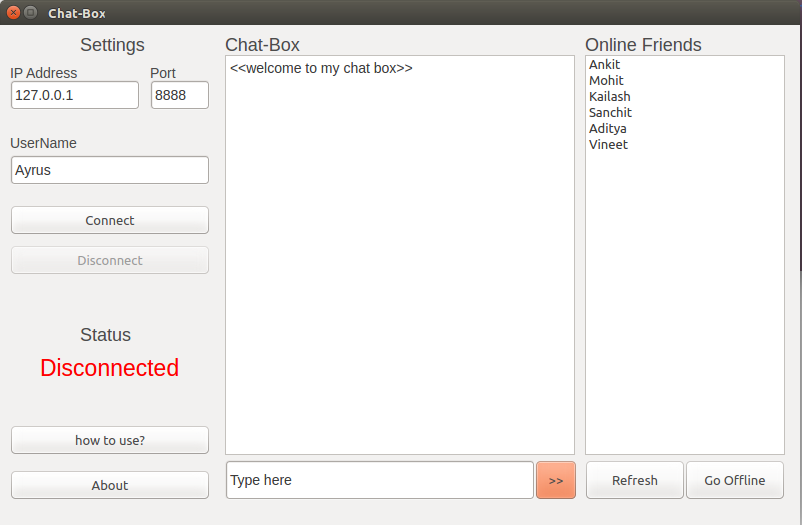

# Chat Aplication using Python QtNetwork
This is very basic chat application based on TCP Sockets. I have implementated this using QtNetwork module.

### How to run this application
#### Requirements:
1. Python
2. PyQt4(for GUI)

####  Procedure:
1. Run "chat.py" using this command "python chat.py"
2. Create Server using this command "python chat-server.py"
3. Invite other user :)

## Screenshots

